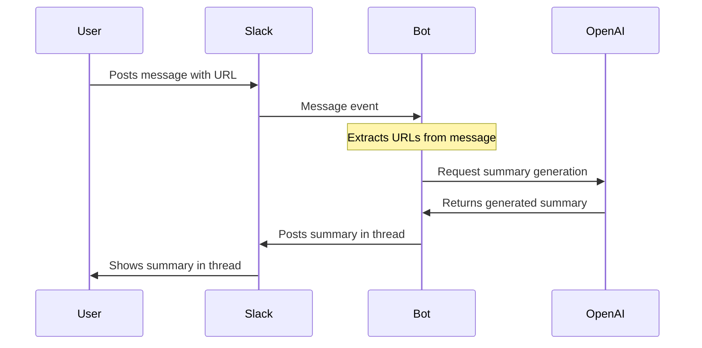

# Slack Link Summarizer Bot

A Slack bot that automatically summarizes web links shared in a specific Slack channel using OpenAI's API.

## How it Works

When a user posts a message containing a URL in the designated Slack channel, the bot automatically detects the link, processes it, and generates a concise summary using OpenAI's models. The summary is then posted as a reply in the message thread.

## Flow Diagram

## Features

- Automatic URL detection in messages
- Integration with OpenAI's models for summarization
- Thread-based responses to keep conversations organized
- Concise, one-paragraph summaries
- Ignores bot messages to prevent loops

## Technical Details

- Built with Node.js
- Uses the Slack Bolt framework for Slack integration
- Leverages OpenAI's API for content summarization
- Runs in socket mode for real-time message processing
